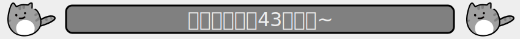

# 我是小猫
  

本仓库收集`“我是小猫”`表情包相关的梗图。  

[点我欣赏本仓库收藏的所有梗图](https://yunline.github.io/LittleCatMemeCollection/)  

  

 # 贡献规则

## 特别提醒
编辑完成之后，请运行[update_index.py](update_index.py)，此脚本会检查编辑后各类文件格式是否正确，然后自动更新相关的数据。

 ## 贡献规则

所有人都可以为本仓库**创作**梗图或者**转载**别人制作的梗图（不侵犯版权的前提下）。  

梗图储存在[cats](./cats)目录下的文件夹中，每一个文件夹储存一张梗图。文件夹的名字即是梗图的名字。  

文件夹结构如下（参考[我是模板小猫](templates/我是模板小猫)）。  

```python
cats/
│   小猫1/
│   小猫2/
│   ···
│
└─  我是模板小猫/  #文件夹的名字即是梗图的名字
    │  info.json    #梗图信息 info.json (编码：UTF-8)
    └─ 模板小猫.png #梗图本体
```

其中,`info.json`格式如下
```json
{
    "img":"模板小猫.png（图像本体的文件名）", 
    "author":"创作者（未知作者，则键值为空字符串）",
    "license":"作品的版权协议名称（只写名称，不写全文。没有协议，则键值为空字符串）",
    "description":"介绍内容（最大字符数100）"
}
```